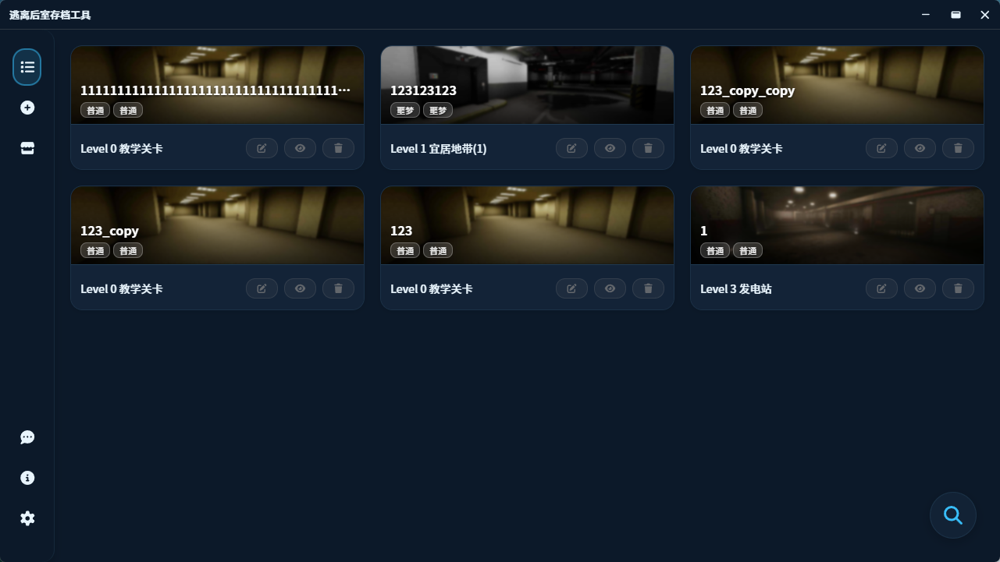
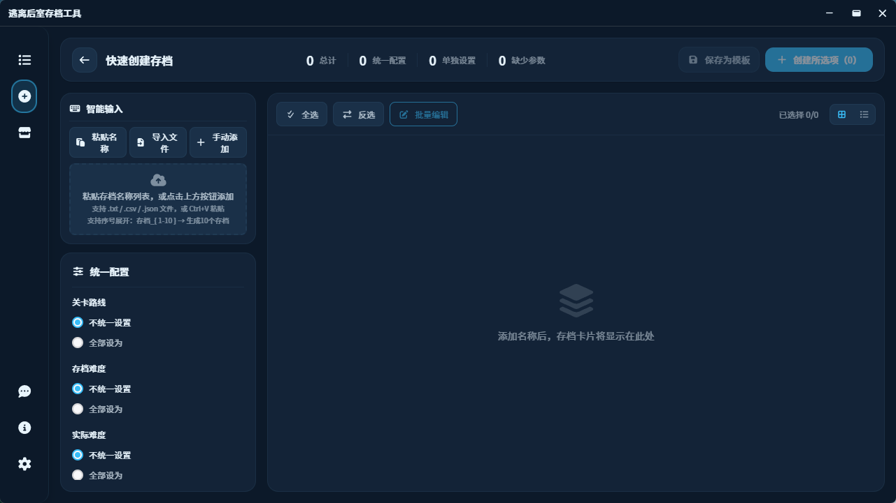
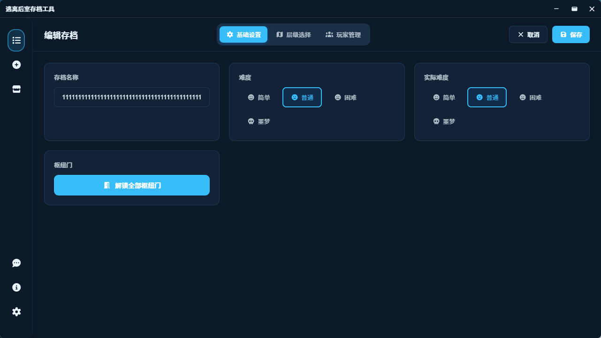

# 🕳️ 逃离后室存档管理器 (E.T.B. Save Manager)

<p align="center">
  
</p>

<p align="center">
  <a href="https://github.com/Eververdants/ETBSaveManager/releases"></a>
  <a href="LICENSE"></a>
  
  
</p>

<p align="center">
  <b>一款现代化、跨平台的《逃离后室》存档管理工具</b>
</p>

<p align="center">
  <a href="#">简体中文</a> | <a href="./README-HANT.md">繁體中文</a> | <a href="./README.md">English</a>
</p>

---

## ✨ 功能特性

### 🗂️ 存档管理

- **完整的增删改查** — 创建、编辑、删除、复制、隐藏/显示存档
- **批量操作** — 同时处理多个存档
- **智能筛选** — 按层级、难度、游戏模式筛选
- **快速搜索** — 模糊匹配，即时定位目标存档

### 🎨 现代化界面

- **现代化设计** — 简洁直观的界面，流畅的动画效果
- **主题系统** — 浅色、深色主题，以及节日特别主题
- **响应式布局** — 可折叠侧边栏，自适应组件
- **硬件加速** — GPU 优化渲染，确保流畅体验

### 🌍 多语言支持

内置语言：

- 简体中文
- 繁體中文
- English

通过插件扩展：

- 日本語 (日语)
- 한국어 (韩语)
- Русский (俄语)
- Português (巴西葡萄牙语)

> ⚠️ **注意：** 语言插件可能不会随版本更新而及时更新。

### 🛠️ 高级功能

- **多种创建模式**
  - 快速创建 — 简化流程，快速生成存档
  - 蓝图创建（实验功能）— 节点图编排，需在 设置 > 开发者选项 启用
  - 标准创建 — 完整的自定义选项
- **蓝图模板** — 保存并复用蓝图流程
- **背包编辑器** — 直接修改玩家背包物品
- **Steam 缓存管理** — 管理本地 Steam 缓存数据
- **反馈系统** — 内置反馈提交功能，直达开发者
- **插件市场** — 从插件市场下载语言包和主题
- **性能监控** — 内置诊断工具（开发模式）

---

## 🖥️ 界面预览

> 以下截图使用"海洋"主题演示

<p align="center">
  
  
</p>

<p align="center">
  
  
</p>

---

## 📦 安装方式

### 下载安装包

1. 前往 [Releases 页面](https://github.com/Eververdants/ETBSaveManager/releases/tag/v3.0.0-Beta-2)
2. 下载 Windows 安装包（`.msi` 或 `.exe`）
3. 运行安装程序

> **提示：** 可能需要安装 [WebView2 运行时](https://developer.microsoft.com/microsoft-edge/webview2)（Windows 10/11 通常已预装）

### 从源码构建

```bash
# 克隆仓库
git clone https://github.com/Eververdants/ETBSaveManager.git
cd ETBSaveManager

# 安装依赖
pnpm install

# 开发模式运行
pnpm tauri dev

# 构建生产版本
pnpm tauri build
```

**环境要求：**

- Node.js 18+
- Rust 工具链
- 平台相关依赖（参见 [Tauri 环境配置](https://tauri.app/v1/guides/getting-started/prerequisites)）

---

## 🧰 技术栈

| 层级     | 技术                     |
| -------- | ------------------------ |
| 前端框架 | Vue 3 + Composition API  |
| 样式方案 | CSS Variables + 主题系统 |
| 构建工具 | Vite 6                   |
| 桌面框架 | Tauri 2.0 + Rust         |
| 国际化   | vue-i18n                 |
| 动画库   | GSAP                     |
| 虚拟滚动 | @tanstack/vue-virtual    |

---

## 📁 项目结构

```
ETBSaveManager/
├── src/                    # Vue 前端
│   ├── components/         # 可复用 UI 组件
│   ├── views/              # 页面组件
│   ├── styles/             # 主题系统 & CSS
│   ├── i18n/               # 国际化
│   ├── services/           # 业务逻辑
│   └── utils/              # 工具函数
├── src-tauri/              # Rust 后端
│   └── src/                # Tauri 命令 & 逻辑
└── public/                 # 静态资源
    └── icons/              # 游戏图标 & UI 素材
```

---

## 🚧 开发进度

**当前版本：** `v3.0.0-Beta-2`

> 🎉 **v3.0.0 正式版**将于 **2026年2月15日 12:00 (CST)** 发布

| 功能         | 状态          |
| ------------ | ------------- |
| 核心存档管理 | ✅ 已完成     |
| 搜索与筛选   | ✅ 已完成     |
| 主题系统     | ✅ 已完成     |
| 多语言支持   | ✅ 已完成     |
| 存档数据编辑 | ✅ 已完成     |
| 多种创建模式 | ✅ 已完成（蓝图为实验功能） |
| 反馈系统     | ✅ 已完成     |
| 插件系统     | ✅ 已完成     |
| 层级信息编辑 | 🔄 计划中     |

---

## 🎬 视频教程

观看详细的操作指南：[Bilibili 视频介绍](https://www.bilibili.com/video/BV1L3yeYzEfi)（基于 2.6.0 版本）

---

## 🤝 参与贡献

欢迎贡献代码！这是一个个人学生项目，任何帮助都非常感谢。

- 🐛 [报告 Bug](https://github.com/Eververdants/ETBSaveManager/issues)
- 💡 [功能建议](https://github.com/Eververdants/ETBSaveManager/issues)
- 📧 联系邮箱：**llzgd@outlook.com**

---

## ⚠️ 免责声明

本项目与 Fancy Games 或《逃离后室》游戏**没有任何关联**，未获得官方认可或授权。项目中使用的游戏素材仅用于教育和工具开发目的。

---

## 📄 开源许可

[MIT License](LICENSE) © 2024-NOW Eververdants

---

<p align="center">
  <sub>使用 Vue.js 和 Tauri 用 ❤️ 构建</sub>
</p>
