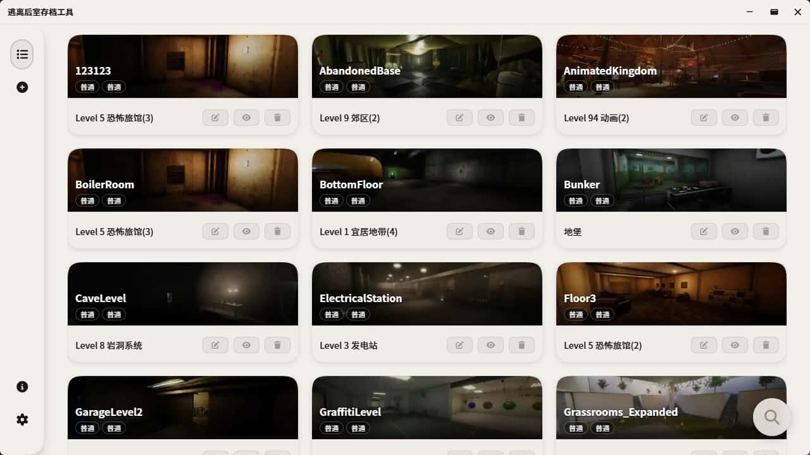
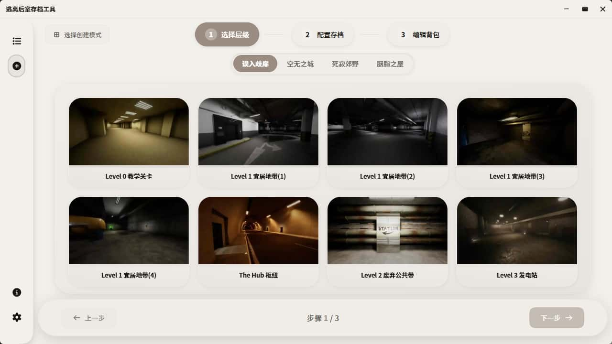
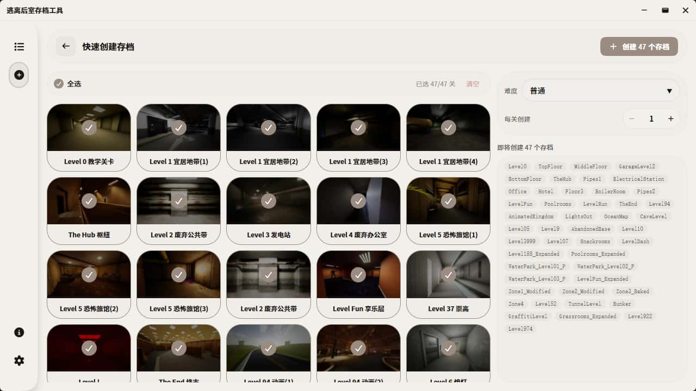
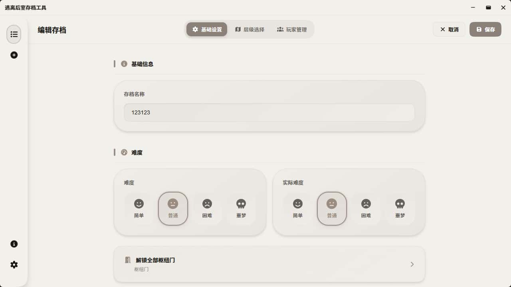

<p align="center">
  
</p>

<h1 align="center">ETB Save Manager</h1>

<p align="center">
  <a href="https://github.com/Eververdants/ETBSaveManager/releases"></a>
  <a href="LICENSE"></a>
  
  
</p>

<p align="center">
  <b>一款现代化、跨平台的《逃离后室》存档管理工具</b>
</p>

<p align="center">
  <a href="#">简体中文</a> | <a href="./README-HANT.md">繁體中文</a> | <a href="./README.md">English</a>
</p>

---

## ✨ 功能特性

### 🗂️ 存档管理

- **完整增删改查** — 创建、查看、编辑、重命名、复制、删除、隐藏/显示存档
- **软删除与回收站** — 误删存档可从回收站恢复，支持彻底删除
- **批量操作** — 多选模式，同时复制、删除或导出多个存档
- **多维排序** — 按名称、创建时间、修改时间或游戏关卡排序
- **智能筛选** — 按游戏关卡、难度模式、游戏模式或关键词筛选
- **模糊搜索** — 输入即搜，实时定位目标存档
- **撤销/重做** — 所有存档操作均支持撤销与重做，操作失误不再是问题
- **虚拟滚动** — 基于 @tanstack/vue-virtual 实现的大列表流畅渲染，即使数百个存档也不卡顿

### ✏️ 存档编辑与玩家数据工具

- **背包编辑器** — 可视化编辑玩家背包物品，支持添加、删除和修改
- **玩家数据编辑** — 编辑理智值等 UE4 存档中的玩家属性
- **快速创建** — 简化流程，数秒内生成新存档文件
- **标准创建向导** — 分步向导，提供完整的自定义选项

### 🎨 现代化界面

- **简洁设计** — 直观的界面，搭配 GSAP 驱动的流畅动画
- **13 套主题** — 浅色、深色及 10 套色彩主题
- **响应式布局** — 可折叠侧边栏，自适应组件
- **硬件加速** — GPU 优化渲染，确保流畅体验
- **全局搜索** — 任意页面按 `Ctrl+F` 即时搜索
- **新手引导** — 首次使用时的交互式引导覆盖层

### 🌍 多语言支持

内置语言：

- 简体中文
- 繁體中文
- English

> 国际化系统采用模块化设计，可通过添加新的语言文件来贡献更多语言。

### 🛠️ 高级功能

- **多种创建模式**
  - 快速创建 — 简化流程，快速生成存档
  - 标准创建 — 完整的自定义选项，分步向导
- **背包编辑器** — 可视化的玩家背包物品编辑器
- **玩家数据编辑** — 编辑背包物品、理智值等玩家属性
- **通知系统** — 持久化通知中心，追踪应用事件
- **性能监控** — 内置 FPS 与内存诊断工具（开发模式）
- **性能设置** — 调整 GPU 渲染与动画偏好
- **统一配置面板** — 集中化的配置管理界面

---

## 🖥️ 界面预览

> 以下截图使用"海洋"主题演示

<p align="center">
  
  
</p>
<p align="center">
  
  
</p>

---

## 📦 安装方式

### 方式一：下载安装包（推荐）

1. 前往 [最新发布页面](https://github.com/Eververdants/ETBSaveManager/releases/latest)
2. 下载 Windows 安装包（`.exe` 格式）
3. 运行安装程序 — 无需额外配置

> **提示：** 本应用需要 [WebView2 运行时](https://developer.microsoft.com/microsoft-edge/webview2)，Windows 10/11 通常已预装。如未安装，安装程序可自动获取。

### 方式二：从源码构建

```bash
# 克隆仓库
git clone https://github.com/Eververdants/ETBSaveManager.git
cd ETBSaveManager

# 安装依赖
npm install

# 开发模式运行（热重载）
npm run tauri dev

# 构建生产版本（生成安装包）
npm run tauri build
```

**环境要求：**

- **Node.js 18+** — 运行时
- **Rust 工具链** — 编译 Tauri 后端所需（`rustc`、`cargo`）
- **平台相关依赖** — 参见 [Tauri v2 环境配置指南](https://v2.tauri.app/start/prerequisites/)

---

## 🧰 技术栈

### 前端

| 技术 | 版本 | 用途 |
|------|------|------|
| [Vue 3](https://vuejs.org/) + Composition API | 3.x | 响应式 UI 框架 |
| [TypeScript](https://www.typescriptlang.org/) | 5.x | 类型安全开发 |
| [Vite](https://vite.dev/) | 6 | 构建工具和开发服务器 |
| [Tailwind CSS](https://tailwindcss.com/) | 4 | 原子化 CSS 框架 |
| CSS 自定义属性 | — | 动态主题系统 |
| [vue-i18n](https://vue-i18n.intlify.dev/) | — | 国际化 |
| [Vue Router](https://router.vuejs.org/) | 4 | 单页应用路由 |
| [GSAP](https://gsap.com/) | — | 高性能动画 |
| [@tanstack/vue-virtual](https://tanstack.com/virtual) | — | 大数据列表虚拟滚动 |
| [FontAwesome](https://fontawesome.com/) | 7 | 矢量图标库 |
| [Chart.js](https://www.chartjs.org/) | — | 数据可视化 |
| [@vue-flow/core](https://vueflow.dev/) | — | 节点式流程编辑器 |
| [vitest](https://vitest.dev/) + [fast-check](https://fast-check.dev/) | — | 单元测试与属性测试 |

### 后端（Rust / Tauri）

| 技术 | 版本 | 用途 |
|------|------|------|
| [Tauri](https://v2.tauri.app/) | 2.0 | 桌面应用框架（Rust + WebView） |
| [uesave](https://crates.io/crates/uesave) | 0.6.2 | UE4 存档文件解析与序列化 |
| [serde](https://serde.rs/) + serde_json | — | 数据序列化/反序列化 |
| [rusqlite](https://github.com/rusqlite/rusqlite) | — | 本地 SQLite 数据库 |
| [tokio](https://tokio.rs/) + [reqwest](https://docs.rs/reqwest/) | — | 异步 HTTP 客户端（更新检查） |
| [walkdir](https://github.com/BurntSushi/walkdir) + [memmap2](https://docs.rs/memmap2/) | — | 高效文件遍历与内存映射 I/O |
| [rayon](https://github.com/rayon-rs/rayon) | — | 并行数据处理 |
| [chrono](https://github.com/chronotope/chrono) | — | 日期时间处理 |
| [uuid](https://github.com/uuid-rs/uuid) | — | 唯一标识符生成 |
| [regex](https://github.com/rust-lang/regex) | — | 正则表达式模式匹配 |
| [thiserror](https://docs.rs/thiserror/) | — | 错误类型派生 |

---

## 🎨 主题画廊

ETB Save Manager 内置 **10 套主题**：

### 基础主题
- **Light（浅色）** — 清新的浅色日间主题
- **Dark（深色）** — 舒适的深色夜间主题

### 色彩主题
| 主题 | 描述 | 色调 |
|------|------|------|
| **Ocean（海洋）** | 深蓝色海洋风格 | 蓝色系、青色系 |
| **Forest（森林）** | 自然绿色森林风格 | 绿色系、大地色系 |
| **Sunset（日落）** | 温暖橙色日落色调 | 橙色系、红色系 |
| **Lavender（薰衣草）** | 柔和紫色薰衣草 | 紫色系、紫罗兰色系 |
| **Rose（玫瑰）** | 优雅粉色玫瑰 | 粉色系 |
| **Mint（薄荷）** | 清新薄荷绿 | 薄荷色、鼠尾草色 |
| **Peach（蜜桃）** | 柔和蜜桃色调 | 蜜桃色、珊瑚色 |
| **Sky（天空）** | 明亮天空蓝 | 天蓝色、白色系 |

---

## 项目结构

```
ETBSaveManager/
├── src/                              # Vue 3 前端（TypeScript）
│   ├── components/
│   │   ├── archive/                  # 存档相关 UI 组件
│   │   │   ├── ArchiveCard.vue
│   │   │   ├── ArchiveCardFlow.vue
│   │   │   ├── ArchiveSearchFilter.vue
│   │   │   └── QuickCreateArchiveCard.vue
│   │   ├── feature/                  # 功能组件
│   │   │   ├── FloatingActionButton.vue
│   │   │   ├── GlobalSearchPanel.vue
│   │   │   ├── InventoryItemSelector.vue
│   │   │   ├── PreviewExecuteArea.vue
│   │   │   └── SmartInputArea.vue
│   │   ├── layout/                   # 布局组件
│   │   │   ├── Sidebar.vue
│   │   │   └── TitleBar.vue
│   │   ├── modal/                    # 模态对话框
│   │   │   ├── ArchiveEditModal.vue
│   │   │   ├── ConfirmModal.vue
│   │   │   └── PromptPopup.vue
│   │   ├── system/                   # 系统工具
│   │   │   ├── PerformanceMonitor.vue
│   │   │   ├── PerformanceSettings.vue
│   │   │   ├── PlayerManager.vue
│   │   │   └── UniformConfigPanel.vue
│   │   ├── theme/                    # 主题系统
│   │   │   └── ThemeSelector.vue
│   │   └── ui/                       # 可复用 UI 组件
│   │       ├── CustomDropdown.vue
│   │       ├── CustomSlider.vue
│   │       ├── ErrorBoundary.vue
│   │       ├── LazyImage.vue
│   │       └── NotificationPopup.vue
│   ├── composables/                  # Vue 组合式函数
│   │   ├── useArchiveActions.ts      # 存档 CRUD 操作
│   │   ├── useArchiveData.ts         # 存档数据管理
│   │   ├── useArchiveCard.ts         # 卡片交互
│   │   ├── useArchiveCardFlow.ts     # 流模式逻辑
│   │   ├── useArchiveFilters.ts      # 筛选与搜索
│   │   ├── useUndoRedo.ts            # 撤销/重做
│   │   ├── useGlobalSearchPanel.ts   # 全局搜索
│   │   └── ...（更多组合式函数）
│   ├── config/                       # 应用配置
│   │   ├── sidebarMenu.ts
│   │   ├── updateConfig.ts
│   │   └── version.ts
│   ├── i18n/                         # 国际化
│   │   ├── index.ts
│   │   ├── loader.ts
│   │   └── locales/
│   │       ├── en-US/                # 英语语言文件
│   │       ├── zh-CN/                # 简体中文
│   │       └── zh-TW/                # 繁體中文
│   ├── router/                       # Vue Router 配置
│   ├── services/                     # 业务逻辑服务
│   │   ├── storageService.ts         # SQLite 持久化存储
│   │   ├── logService.ts             # 日志服务
│   │   ├── notificationService.ts    # 通知中心
│   │   ├── popupService.ts           # 弹窗管理
│   │   ├── themeStorage.ts           # 主题持久化
│   │   ├── pluginStorage.ts          # 插件数据存储
│   │   └── updateService.ts          # 自动更新检查
│   ├── styles/
│   │   ├── animations.css
│   │   └── themes/                   # 主题 CSS 文件
│   │       ├── _colors.css / _components.css / _semantic.css
│   │       ├── light.css / dark.css / high-contrast.css
│   │       ├── ocean.css / forest.css / sunset.css
│   │       ├── lavender.css / rose.css / mint.css
│   │       ├── peach.css / sky.css
│   │       └── index.css
│   ├── utils/                        # 工具函数
│   ├── views/                        # 页面视图
│   │   ├── Home.vue                  # 存档列表（主视图）
│   │   ├── CreateArchive/            # 创建存档向导
│   │   ├── EditArchive.vue           # 存档编辑器
│   │   ├── QuickCreateArchive.vue    # 快速创建存档
│   │   ├── SelectCreateMode.vue      # 创建模式选择
│   │   ├── Settings.vue              # 应用设置
│   │   └── About.vue                 # 关于页面
│   ├── types.ts                      # 全局类型定义
│   ├── appContext.ts                 # 依赖注入上下文
│   ├── App.vue                       # 根组件
│   └── main.ts                       # 应用入口
├── src-tauri/                        # Rust 后端（Tauri）
│   └── src/
│       ├── lib.rs                    # 库入口 / Tauri 设置
│       ├── main.rs                   # 主入口
│       ├── save_commands.rs          # 存档 CRUD Tauri 命令
│       ├── save_editor.rs            # 存档文件编辑逻辑
│       ├── save_shared.rs            # 共享存档类型
│       ├── save_utils.rs             # 存档文件工具函数
│       ├── new_save.rs               # 存档创建逻辑
│       ├── player_data.rs            # 玩家数据处理
│       ├── cli_handlers.rs           # CLI 命令处理
│       ├── system_commands.rs        # 系统级 Tauri 命令
│       ├── theme_commands.rs         # 主题管理
│       ├── gpu_settings.rs           # GPU/渲染配置
│       ├── get_file_path.rs          # 文件路径解析
│       ├── common.rs                 # 通用辅助函数
│       └── error.rs                  # 错误类型定义
├── public/                           # 静态资源
│   ├── icons/                        # 游戏物品图标
│   └── images/                       # 关卡图片
├── docs/                             # 截图与文档
├── scripts/                          # 构建脚本
│   └── sync-version.js               # 版本同步
├── dist/                             # 构建输出
├── index.html                        # HTML 入口
├── vite.config.ts                    # Vite 配置
├── tsconfig.json                     # TypeScript 配置
├── eslint.config.js                  # ESLint 配置
├── package.json
└── pnpm-lock.yaml
```

---

## 🎨 主题列表

ETB Save Manager 内置 13 套主题：

### 基础主题
- **Light（浅色）** — 清新的浅色主题
- **Dark（深色）** — 舒适的深色主题

### 色彩主题
- **Ocean（海洋）** 深蓝色海洋风格
- **Forest（森林）** 自然绿色森林风格
- **Sunset（日落）** 温暖的橙色日落色调
- **Lavender（薰衣草）** 柔和的紫色薰衣草
- **Rose（玫瑰）** 优雅的粉色玫瑰
- **Mint（薄荷）** 清新的薄荷绿
- **Peach（蜜桃）** 柔和的蜜桃色调
- **Sky（天空）** 明亮的天空蓝

### 实用主题
- **Custom（自定义）** — 通过主题编辑器自定义配色

---

## 参与贡献

欢迎各种形式的贡献！这是一个个人学生项目，任何帮助 — 无论是代码、Bug 报告、翻译还是文档 — 都备受感激。

- [报告 Bug](https://github.com/Eververdants/ETBSaveManager/issues)
- [功能建议](https://github.com/Eververdants/ETBSaveManager/issues)
- 联系邮箱：**llzgd@outlook.com**

---

## ⚠️ 免责声明

本项目**与 Fancy Games 或《逃离后室》没有任何关联、背书或连接**。

游戏素材（如关卡图标）**仅用于识别目的**，以帮助用户识别存档所属的关卡。  
《逃离后室》及其素材的所有权利均属于其各自所有者。

---

## 星标历史

<p align="center">
  <a href="https://star-history.com/#Eververdants/ETBSaveManager&Date">
    <picture>
      <source media="(prefers-color-scheme: dark)" srcset="https://api.star-history.com/svg?repos=Eververdants/ETBSaveManager&type=Date&theme=dark" />
      <source media="(prefers-color-scheme: light)" srcset="https://api.star-history.com/svg?repos=Eververdants/ETBSaveManager&type=Date" />
      
    </picture>
  </a>
</p>

---

## 开源许可

[MIT License](LICENSE) © 2026 Eververdants

---

## ⭐ 支持项目

ETB Save Manager 是一个开源社区项目。如果您觉得它有用，欢迎在 GitHub 上为仓库点亮星标！

<p align="center">
  <a href="https://github.com/Eververdants/ETBSaveManager/stargazers">
    
  </a>
</p>

---

## ⚠️ 免责声明

本项目**与 Fancy Games 或《逃离后室》（Escape The Backrooms）没有任何关联、背书或连接关系**。

游戏素材（如关卡图标、物品图标）**仅用于识别目的**，帮助用户辨认存档所属的关卡或物品。  
《逃离后室》及其素材的所有权利均属于其各自所有者。

---

<p align="center">
  <sub>使用 Vue.js 和 Tauri 用 ❤️ 构建</sub>
</p>
