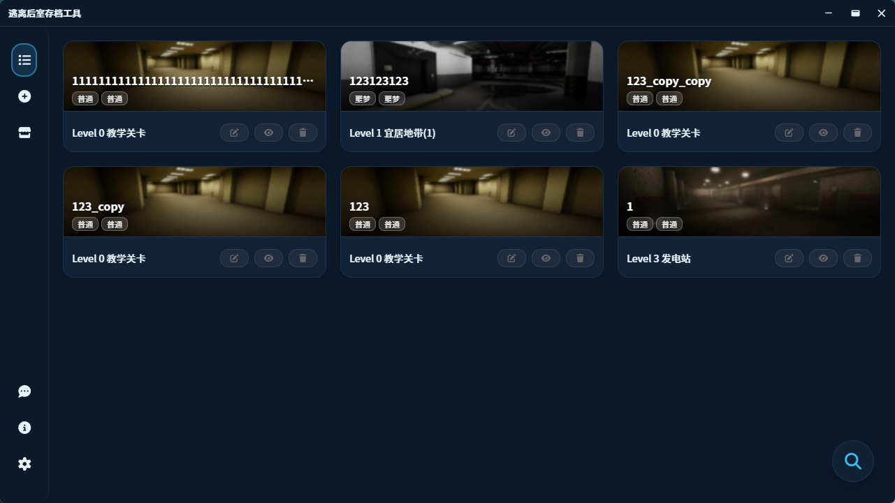
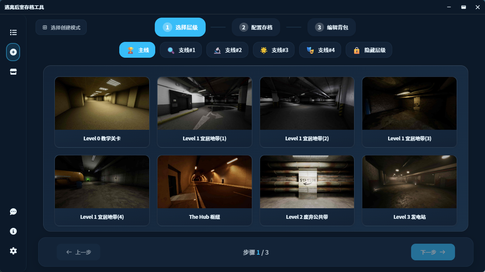
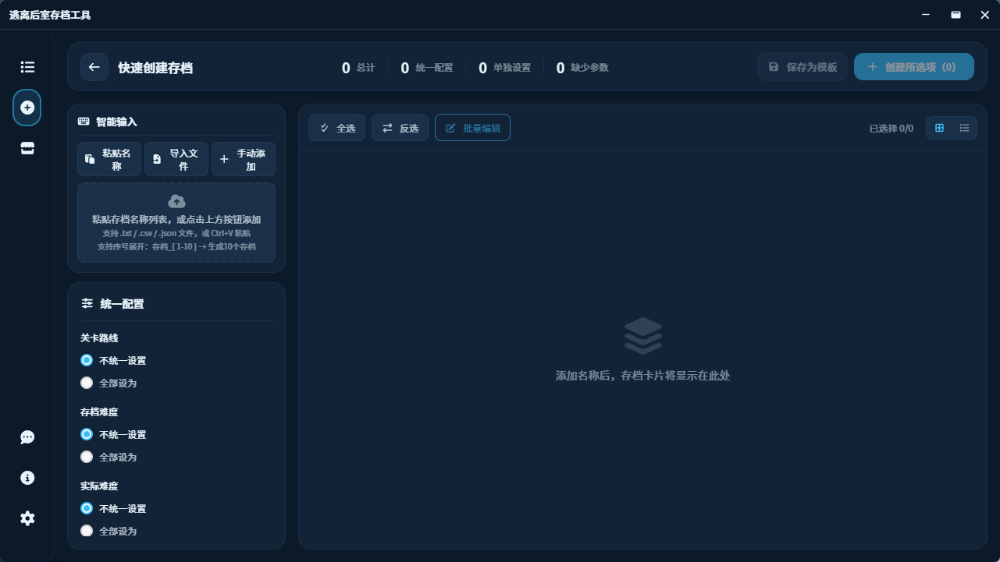
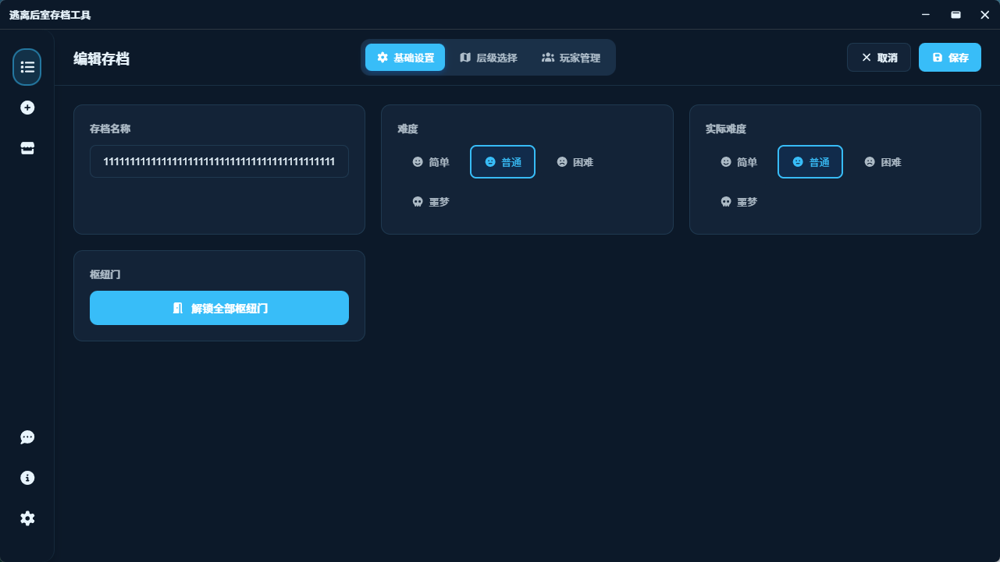

# 🕳️ 逃離後室存檔管理器 (E.T.B. Save Manager)

<p align="center">
  
</p>

<p align="center">
  <a href="https://github.com/Eververdants/ETBSaveManager/releases"></a>
  <a href="LICENSE"></a>
  
  
</p>

<p align="center">
  <b>一款現代化、跨平台的《逃離後室》存檔管理工具</b>
</p>

<p align="center">
  <a href="./README-CN.md">简体中文</a> | <a href="#">繁體中文</a> | <a href="./README.md">English</a>
</p>

---

## ✨ 功能特性

### 🗂️ 存檔管理

- **完整的增刪改查** — 建立、編輯、刪除、複製、隱藏/顯示存檔
- **批次操作** — 同時處理多個存檔
- **智慧篩選** — 按層級、難度、遊戲模式篩選
- **快速搜尋** — 模糊匹配，即時定位目標存檔
- **虛擬捲動** — 大量存檔時依然流暢

### 🎨 現代化介面

- **現代化設計** — 簡潔直觀的介面，流暢的動畫效果
- **15+ 主題** — 淺色、深色、多彩主題以及節日特別主題
- **響應式佈局** — 可摺疊側邊欄，自適應元件
- **硬體加速** — GPU 優化渲染，確保流暢體驗
- **GSAP 動畫** — 專業級動畫效果

### 🌍 多語言支援

內建語言：

- 简体中文
- 繁體中文
- English

透過外掛擴充：

- 日本語 (日語)
- 한국어 (韓語)
- Русский (俄語)
- Português (巴西葡萄牙語)

> ⚠️ **注意：** 語言外掛可能不會隨版本更新而及時更新。

### 🛠️ 進階功能

- **多種建立模式**
  - 快速建立 — 簡化流程，快速產生存檔
  - 標準建立 — 完整的自訂選項，分步嚮導
- **背包編輯器** — 可視化的玩家背包物品編輯器
- **玩家資料編輯** — 編輯生命值、位置等玩家屬性
- **Steam 快取管理** — 管理本機 Steam 快取資料
- **反饋系統** — 內建反饋提交功能，支援離線佇列
- **外掛市場** — 從外掛市場下載語言包和主題
- **效能監控** — 內建診斷工具（開發模式）
- **自動更新** — 自動檢查並安裝更新

---

## 🖥️ 介面預覽

> 以下截圖使用「海洋」主題演示

<p align="center">
  
  
</p>

<p align="center">
  
  
</p>

---

## 📦 安裝方式

### 下載安裝包

1. 前往 [Releases 頁面](https://github.com/Eververdants/ETBSaveManager/releases/latest)
2. 下載 Windows 安裝包（`.msi` 或 `.exe`）
3. 執行安裝程式

> **提示：** 可能需要安裝 [WebView2 執行環境](https://developer.microsoft.com/microsoft-edge/webview2)（Windows 10/11 通常已預裝）

### 從原始碼建置

```bash
# 複製儲存庫
git clone https://github.com/Eververdants/ETBSaveManager.git
cd ETBSaveManager

# 安裝相依套件
pnpm install

# 開發模式執行
pnpm tauri dev

# 建置生產版本
pnpm tauri build
```

**環境需求：**

- Node.js 18+
- Rust 工具鏈
- 平台相關相依套件（參見 [Tauri 環境設定](https://tauri.app/v1/guides/getting-started/prerequisites)）

---

## 🧰 技術棧

### 前端

| 技術 | 用途 |
|------|------|
| Vue 3 + Composition API | 響應式 UI 框架 |
| Vite 6 | 建置工具和開發伺服器 |
| Tailwind CSS 4 | 原子化 CSS 框架 |
| CSS Variables | 動態主題系統 |
| vue-i18n | 國際化 |
| Vue Router 4 | 單頁應用路由 |
| GSAP | 高效能動畫 |
| @tanstack/vue-virtual | 大數據列表虛擬捲動 |
| FontAwesome 7 | 向量圖示 |
| Chart.js | 資料視覺化 |
| @vue-flow/core | 節點流程編輯器 |

### 後端 (Rust)

| 技術 | 用途 |
|------|------|
| Tauri 2.0 | 桌面應用框架 |
| uesave 0.6.2 | UE4 存檔檔案解析 |
| serde + serde_json | 資料序列化 |
| aes-gcm + argon2 | 加密和安全 |
| rusqlite | 本機 SQLite 資料庫 |
| reqwest + tokio | 非同步 HTTP 客戶端 |
| walkdir + memmap2 | 高效檔案操作 |

---

## 📁 專案結構

```
ETBSaveManager/
├── src/                          # Vue 前端
│   ├── components/               # UI 元件
│   │   ├── plugin/              # 外掛相關元件
│   │   ├── ArchiveCard.vue      # 存檔卡片元件
│   │   ├── ArchiveSearchFilter.vue # 搜尋篩選面板
│   │   ├── Sidebar.vue          # 側邊導航欄
│   │   ├── TitleBar.vue         # 視窗標題欄
│   │   └── ...                  # 其他元件
│   ├── composables/             # Vue 組合式函式
│   │   ├── useArchiveActions.js # 存檔操作邏輯
│   │   ├── useArchiveData.js    # 存檔資料管理
│   │   └── ...                  # 其他組合式函式
│   ├── config/                  # 設定檔
│   ├── i18n/                    # 國際化
│   │   └── locales/             # 語言檔案
│   │       ├── zh-CN/           # 簡體中文
│   │       ├── zh-TW/           # 繁體中文
│   │       └── en-US/           # 英語
│   ├── plugins/                 # 外掛系統
│   │   ├── core/                # 外掛管理器
│   │   └── loaders/             # 外掛載入器（語言、主題、頁面）
│   ├── router/                  # Vue Router 設定
│   ├── services/                # 業務邏輯服務
│   ├── styles/                  # 樣式系統
│   │   └── themes/              # 主題檔案（15+ 主題）
│   ├── utils/                   # 工具函式
│   ├── views/                   # 頁面視圖
│   │   ├── CreateArchive/       # 建立存檔嚮導
│   │   ├── Home.vue             # 存檔列表頁
│   │   ├── EditArchive.vue      # 編輯存檔頁
│   │   └── ...                  # 其他頁面
│   ├── App.vue                  # 根元件
│   └── main.js                  # 應用入口
├── src-tauri/                    # Rust 後端
│   └── src/
│       ├── lib.rs               # 庫入口
│       ├── main.rs              # 主程式入口
│       ├── save_commands.rs     # 存檔操作命令
│       ├── save_editor.rs       # 存檔檔案編輯器
│       ├── player_data.rs       # 玩家資料處理
│       ├── steam_api.rs         # Steam API 整合
│       ├── feedback_commands.rs # 反饋系統
│       └── ...                  # 其他模組
├── plugins/                      # 外掛目錄
│   ├── lang-ja-JP/              # 日語語言包
│   ├── lang-ko-KR/              # 韓語語言包
│   ├── lang-ru-RU/              # 俄語語言包
│   ├── lang-pt-BR/              # 巴西葡萄牙語包
│   ├── theme-cyberpunk/         # 賽博龐克主題
│   ├── theme-dracula/           # Dracula 主題
│   ├── theme-monokai/           # Monokai 主題
│   ├── theme-nord/              # Nord 主題
│   └── theme-solarized/         # Solarized 主題
├── public/                       # 靜態資源
│   ├── icons/                   # 遊戲物品圖示（20+）
│   └── images/                  # 遊戲關卡圖片（40+）
└── docs/                         # 文件和截圖
```

---

## 🎨 主題列表

ETB Save Manager 內建 15+ 主題：

### 基礎主題
- **Light（淺色）** — 清新的淺色主題
- **Dark（深色）** — 舒適的深色主題
- **High Contrast（高對比度）** — 無障礙輔助主題

### 彩色主題
- **Ocean（海洋）** 🌊 — 深藍色海洋風格
- **Forest（森林）** 🌲 — 自然綠色森林風格
- **Sunset（日落）** 🌅 — 溫暖的橙色日落色調
- **Lavender（薰衣草）** 💜 — 柔和的紫色薰衣草
- **Rose（玫瑰）** 🌸 — 優雅的粉色玫瑰
- **Mint（薄荷）** 🍃 — 清新的薄荷綠
- **Peach（蜜桃）** 🍑 — 柔和的蜜桃色調
- **Sky（天空）** ☁️ — 明亮的天空藍

### 節日主題
- **New Year（元旦）** 🎊 — 新年慶祝主題
- **Spring Festival（春節）** 🧧 — 中國新年主題（限時）

### 外掛主題
- **Cyberpunk（賽博龐克）** — 霓虹賽博龐克風格
- **Dracula** — 流行的 Dracula 配色方案
- **Monokai** — 經典的 Monokai 主題
- **Nord** — 北歐 Nord 調色盤
- **Solarized** — Solarized 配色方案

---

## 🚧 開發進度

**目前版本：** `v3.1.0`

| 功能 | 狀態 |
|------|------|
| 核心存檔管理 | ✅ 已完成 |
| 搜尋與篩選 | ✅ 已完成 |
| 主題系統（15+ 主題） | ✅ 已完成 |
| 多語言支援 | ✅ 已完成 |
| 存檔資料編輯 | ✅ 已完成 |
| 多種建立模式（快速和標準） | ✅ 已完成 |
| 反饋系統 | ✅ 已完成 |
| 外掛系統 | ✅ 已完成 |
| 主題編輯器 | ✅ 已完成 |
| 背包編輯器 | ✅ 已完成 |
| 玩家資料編輯器 | ✅ 已完成 |
| Steam 快取管理 | ✅ 已完成 |
| 自動更新 | ✅ 已完成 |
| 層級資訊編輯 | 🔄 計劃中 |

---

## 🎬 影片教學

觀看詳細的操作指南：[Bilibili 影片介紹](https://www.bilibili.com/video/BV1L3yeYzEfi)（基於 2.6.0 版本）

---

## 🤝 參與貢獻

歡迎貢獻程式碼！這是一個個人學生專案，任何幫助都非常感謝。

- 🐛 [回報 Bug](https://github.com/Eververdants/ETBSaveManager/issues)
- 💡 [功能建議](https://github.com/Eververdants/ETBSaveManager/issues)
- 📧 聯絡信箱：**llzgd@outlook.com**

### 外掛開發

想要建立自己的語言包或主題？查看 [外掛開發指南](./plugins/PLUGIN_DEV_GUIDE_CN.md)。

---

## ⚠️ 免責聲明

本專案**與 Fancy Games 或《逃離後室》沒有任何關聯、背書或連結**。

遊戲素材（如關卡圖示）**僅用於識別目的**，以協助使用者辨識存檔所屬的關卡。  
《逃離後室》及其素材的所有權利均屬於其各自所有者。

----
---

## 📄 開源授權

[MIT License](LICENSE) © 2024-NOW Eververdants

---

<p align="center">
  <sub>使用 Vue.js 和 Tauri 用 ❤️ 建置</sub>
</p>
