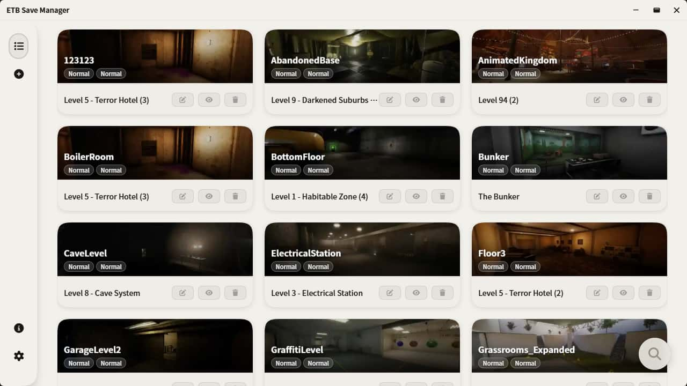
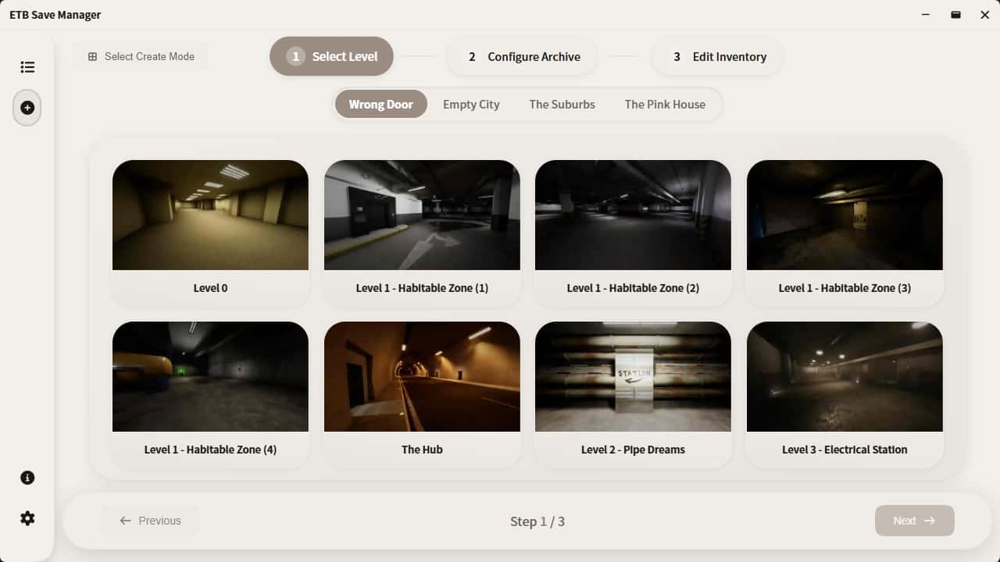
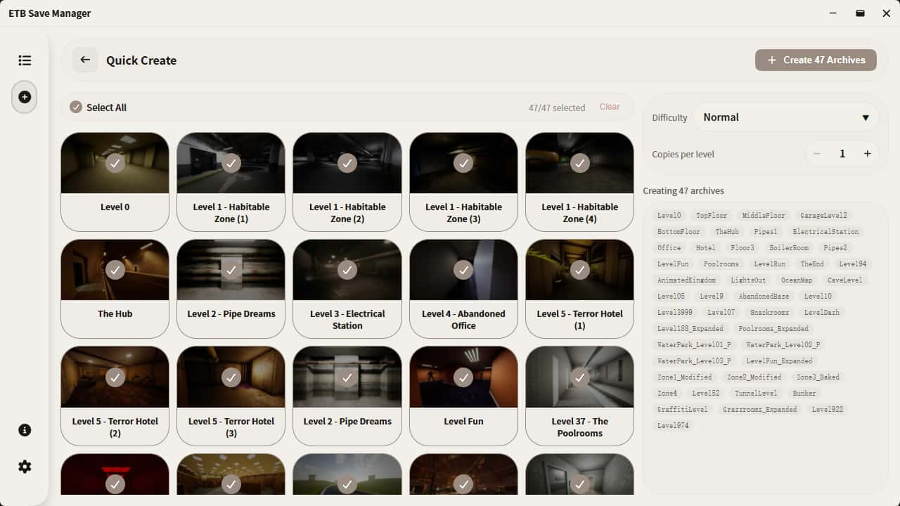
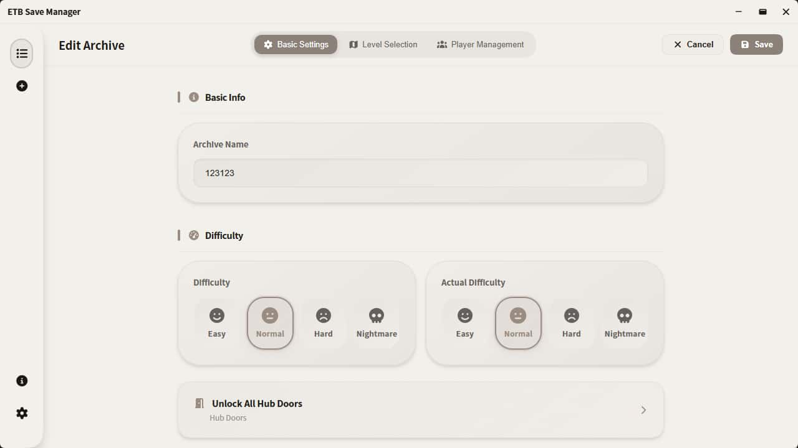

<p align="center">
  
</p>

<h1 align="center">ETB Save Manager</h1>

<p align="center">
  <strong>A full-featured <em>Escape The Backrooms</em> save file manager and editor for Windows, built with Tauri 2.0.</strong>
  <br>
  View, edit, create, back up, and organize your <em>Escape The Backrooms</em> (ETB) save files on Windows with a polished desktop application.
</p>

<p align="center">
  <a href="https://eververdants.github.io/ETBSaveManager/">Landing Page</a>
  <span> · </span>
  <a href="./README-CN.md">简体中文</a>
  <span> · </span>
  <a href="./README-HANT.md">繁體中文</a>
  <span> · </span>
  <a href="#">English</a>
</p>

<p align="center">
  <a href="https://github.com/Eververdants/ETBSaveManager/releases"></a>
  <a href="https://github.com/Eververdants/ETBSaveManager/actions"></a>
  <a href="https://github.com/Eververdants/ETBSaveManager/releases"></a>
  <a href="https://github.com/Eververdants/ETBSaveManager/stargazers"></a>
  <a href="LICENSE"></a>
  
</p>

---

## Why ETB Save Manager?

Managing save files for *Escape The Backrooms* on Windows can be frustrating — save files are scattered across game directories, indistinguishable by name alone, and prone to accidental overwrites. **ETB Save Manager** solves this by providing a clean, powerful desktop tool that lets you:

- **Browse and manage** all your *Escape The Backrooms* save files in one place
- **Edit player data** — inventory items, sanity, and other UE4 save fields
- **Create new saves** from scratch or from templates, with full control over game state
- **Organize** saves with custom names, filtering, and batch operations
- **Recover deleted saves** with soft-delete and a built-in recycle bin

Whether you are a casual player wanting to keep your progress safe or a power user experimenting with different game states, ETB Save Manager gives you complete control over your *Escape The Backrooms* save data.

---

## ✨ Features

### 📂 Save File Management

- **Full CRUD Operations** — Create, view, edit, rename, copy, delete, hide, and reveal saves
- **Soft Delete & Recycle Bin** — Accidentally deleted a save? Restore it from the recycle bin before permanent deletion
- **Batch Operations** — Select multiple saves at once to copy, delete, or export in bulk
- **Multi-Dimension Sorting** — Sort saves by name, creation date, last modified date, or game level
- **Smart Filtering** — Filter saves by game level, difficulty mode, game mode, or search keywords
- **Fuzzy Search** — Type-ahead fuzzy matching to locate any save file instantly
- **Undo / Redo** — Full undo and redo support for all archive operations, so mistakes are never permanent
- **Virtual Scrolling** — Smooth performance even with hundreds of save files, powered by @tanstack/vue-virtual

### ✏️ Save Editor & Player Data Tools

- **Inventory Editor** — Visual editor for the player's inventory items: add, remove, and modify items with an intuitive interface
- **Player Data Editor** — Edit sanity and other player stats stored in the UE4 save format
- **Quick Create** — Streamlined workflow for generating a new save file in seconds
- **Standard Create Wizard** — Full step-by-step wizard with every customization option available

### 🎨 User Interface & Experience

- **Clean, Modern Design** — Intuitive layout with smooth GSAP-powered animations and transitions
- **10 Built-in Themes** — Light, Dark, and 8 colorful themes (Ocean, Forest, Sunset, Lavender, Rose, Mint, Peach, Sky)
- **Responsive Layout** — Collapsible sidebar and adaptive components that work at any window size
- **Hardware Accelerated Rendering** — GPU-optimized rendering pipeline for consistently smooth performance
- **Global Search** — Press `Ctrl+F` from anywhere in the app to search across pages
- **Notification Center** — Persistent notification system tracking all app events and operations
- **Uniform Config Panel** — Centralized configuration interface for all app settings

### 🌐 Internationalization (i18n)

| Language | File |
|----------|------|
| English | `en-US` (default) |
| Simplified Chinese (简体中文) | `zh-CN` |
| Traditional Chinese (繁體中文) | `zh-TW` |

> The i18n system is modular — community contributions for additional languages are welcome. Add new locale files to extend support.

---

## 🖼️ Screenshots

<p align="center">
  
  
</p>
<p align="center">
  
  
</p>

---

## 🚀 Installation

### Option 1: Download Pre-built Installer (Recommended)

1. Go to the [latest release page](https://github.com/Eververdants/ETBSaveManager/releases/latest)
2. Download the Windows installer (`.exe` format)
3. Run the installer — no additional setup required

> **Note:** The app requires the [WebView2 Runtime](https://developer.microsoft.com/microsoft-edge/webview2), which is pre-installed on most modern Windows 10 and Windows 11 systems. If missing, the installer can fetch it automatically.

### Option 2: Build from Source

```bash
# Clone the repository
git clone https://github.com/Eververdants/ETBSaveManager.git
cd ETBSaveManager

# Install dependencies
npm install

# Run in development mode (hot-reload)
npm run tauri dev

# Build for production (creates installer)
npm run tauri build
```

**Prerequisites:**

- **Node.js 18+** — Runtime
- **Rust toolchain** — Required to compile the Tauri backend (`rustc`, `cargo`)
- **Platform-specific dependencies** — See the [Tauri v2 prerequisites guide](https://v2.tauri.app/start/prerequisites/) for your OS

---

## ❓ Frequently Asked Questions

**Q: Is this an official Fancy Games tool?**

A: No. ETB Save Manager is an **independent, community-built open-source project**. It is not affiliated with, endorsed by, or connected to Fancy Games or the developers of *Escape The Backrooms*.

**Q: Will editing save files corrupt my game?**

A: The editor validates data where possible, but modifying save files always carries some risk. **Always back up your original save files** before editing. The app's recycle bin feature provides a safety net — deleted originals can be restored.

**Q: Does this support the latest *Escape The Backrooms* update?**

A: Yes. When new maps or game updates change the save data format, the tool is updated accordingly. Check the [releases page](https://github.com/Eververdants/ETBSaveManager/releases) for the latest update.

**Q: How do I report a bug or request a feature?**

A: Open an issue on the [GitHub issue tracker](https://github.com/Eververdants/ETBSaveManager/issues). Feature requests and bug reports are both welcome.

---

## 🔧 Technology Stack

### Frontend

| Technology | Version | Purpose |
|------------|---------|---------|
| [Vue 3](https://vuejs.org/) + Composition API | 3.x | Reactive UI framework |
| [TypeScript](https://www.typescriptlang.org/) | 5.x | Type-safe development |
| [Vite](https://vite.dev/) | 6 | Build tool and dev server |
| [Tailwind CSS](https://tailwindcss.com/) | 4 | Utility-first CSS framework |
| CSS Custom Properties | — | Dynamic theme system |
| [vue-i18n](https://vue-i18n.intlify.dev/) | — | Internationalization (i18n) |
| [Vue Router](https://router.vuejs.org/) | 4 | SPA routing |
| [GSAP](https://gsap.com/) | — | High-performance animations |
| [@tanstack/vue-virtual](https://tanstack.com/virtual) | — | Virtual scrolling for large lists |
| [FontAwesome](https://fontawesome.com/) | 7 | Vector icon library |
| [Chart.js](https://www.chartjs.org/) | — | Data visualization charts |
| [@vue-flow/core](https://vueflow.dev/) | — | Node-based flow editor |
| [vitest](https://vitest.dev/) + [fast-check](https://fast-check.dev/) | — | Unit and property-based testing |

### Backend (Rust / Tauri)

| Technology | Version | Purpose |
|------------|---------|---------|
| [Tauri](https://v2.tauri.app/) | 2.0 | Desktop application framework (Rust + WebView) |
| [uesave](https://crates.io/crates/uesave) | 0.6.2 | UE4 save file parsing and serialization |
| [serde](https://serde.rs/) + serde_json | — | Data serialization / deserialization |
| [rusqlite](https://github.com/rusqlite/rusqlite) | — | Local SQLite database for app state |
| [tokio](https://tokio.rs/) + [reqwest](https://docs.rs/reqwest/) | — | Async HTTP client (update checks) |
| [walkdir](https://github.com/BurntSushi/walkdir) + [memmap2](https://docs.rs/memmap2/) | — | Efficient file system traversal and memory-mapped I/O |
| [rayon](https://github.com/rayon-rs/rayon) | — | Parallel data processing |
| [chrono](https://github.com/chronotope/chrono) | — | Date and time handling |
| [uuid](https://github.com/uuid-rs/uuid) | — | Unique identifier generation |
| [regex](https://github.com/rust-lang/regex) | — | Regular expression pattern matching |
| [thiserror](https://docs.rs/thiserror/) | — | Ergonomic error type derivation |

---

## 🎨 Theme Gallery

ETB Save Manager ships with **10 built-in themes**:

### Base Themes
- **Light** — Clean light theme for daytime use
- **Dark** — Comfortable dark theme for low-light environments

### Color Themes
| Theme | Description | Palette |
|-------|-------------|---------|
| **Ocean** | Deep blue ocean-inspired | Blues, teals |
| **Forest** | Natural green forest | Greens, earth tones |
| **Sunset** | Warm orange sunset | Oranges, reds |
| **Lavender** | Soft purple lavender | Purples, violets |
| **Rose** | Elegant pink rose | Pinks, roses |
| **Mint** | Fresh mint green | Mint, sage |
| **Peach** | Soft peach tones | Peach, coral |
| **Sky** | Bright sky blue | Sky blues, whites |

---

## Project Structure

```
ETBSaveManager/
├── src/                              # Vue 3 frontend (TypeScript)
│   ├── components/
│   │   ├── archive/                  # Save file UI components
│   │   │   ├── ArchiveCard.vue
│   │   │   ├── ArchiveSearchFilter.vue
│   │   │   └── QuickCreateArchiveCard.vue
│   │   ├── feature/                  # Feature-specific components
│   │   │   ├── FloatingActionButton.vue
│   │   │   ├── GlobalSearchPanel.vue
│   │   │   ├── InventoryItemSelector.vue
│   │   │   └── PreviewExecuteArea.vue
│   │   ├── layout/                   # Layout components
│   │   │   ├── Sidebar.vue
│   │   │   └── TitleBar.vue
│   │   ├── modal/                    # Modal dialogs
│   │   │   ├── ArchiveEditModal.vue
│   │   │   ├── ConfirmModal.vue
│   │   │   └── PromptPopup.vue
│   │   ├── system/                   # System utilities
│   │   │   ├── PerformanceMonitor.vue
│   │   │   ├── PerformanceSettings.vue
│   │   │   └── PlayerManager.vue
│   │   ├── theme/                    # Theme system
│   │   │   └── ThemeSelector.vue
│   │   └── ui/                       # Reusable UI primitives
│   │       ├── CustomDropdown.vue
│   │       ├── CustomSlider.vue
│   │       ├── ErrorBoundary.vue
│   │       ├── LazyImage.vue
│   │       └── NotificationPopup.vue
│   ├── composables/                  # Vue composition functions
│   │   ├── useArchiveActions.ts      # Save CRUD operations
│   │   ├── useArchiveData.ts         # Save data management
│   │   ├── useArchiveCard.ts         # Card interactions
│   │   ├── useArchiveCardFlow.ts     # Flow mode logic
│   │   ├── useArchiveSearchFilter.ts # Filter and search
│   │   ├── useUndoRedo.ts            # Undo / redo support
│   │   ├── useGlobalSearchPanel.ts   # Global search
│   │   └── ... (additional composables)
│   ├── config/                       # Application configuration
│   │   ├── sidebarMenu.ts
│   │   ├── updateConfig.ts
│   │   └── version.ts
│   ├── i18n/                         # Internationalization
│   │   ├── index.ts
│   │   ├── loader.ts
│   │   └── locales/
│   │       ├── en-US/                # English locale files
│   │       ├── zh-CN/                # Simplified Chinese
│   │       └── zh-TW/                # Traditional Chinese
│   ├── router/                       # Vue Router config
│   ├── services/                     # Business logic services
│   │   ├── storageService.ts         # Persistent storage via SQLite
│   │   ├── logService.ts             # Logging service
│   │   ├── notificationService.ts    # Notification center
│   │   ├── popupService.ts           # Popup management
│   │   ├── themeStorage.ts           # Theme persistence
│   │   ├── pluginStorage.ts          # Plugin data storage
│   │   └── updateService.ts          # Auto-update checker
│   ├── styles/
│   │   ├── animations.css
│   │   └── themes/                   # Theme CSS files
│   │       ├── _colors.css / _components.css / _semantic.css
│   │       ├── light.css / dark.css
│   │       ├── ocean.css / forest.css / sunset.css
│   │       ├── lavender.css / rose.css / mint.css
│   │       ├── peach.css / sky.css
│   │       └── index.css
│   ├── utils/                        # Utility functions
│   ├── views/                        # Page views
│   │   ├── Home.vue                  # Save list (main view)
│   │   ├── CreateArchive/            # Save creation wizard
│   │   ├── EditArchive.vue           # Save editor
│   │   ├── QuickCreateArchive.vue    # Quick save creation
│   │   ├── SelectCreateMode.vue      # Mode picker
│   │   ├── Settings.vue              # App settings page
│   │   └── About.vue                 # About page
│   ├── types.ts                      # Global type definitions
│   ├── appContext.ts                 # DI context
│   ├── App.vue                       # Root component
│   └── main.ts                       # Application entry point
├── src-tauri/                        # Rust backend (Tauri)
│   └── src/
│       ├── lib.rs                    # Library entry / Tauri setup
│       ├── main.rs                   # Main entry point
│       ├── save_commands.rs          # Save CRUD Tauri commands
│       ├── save_editor.rs            # Save file editing logic
│       ├── save_shared.rs            # Shared save types
│       ├── save_utils.rs             # Save file utilities
│       ├── new_save.rs               # Save creation logic
│       ├── player_data.rs            # Player data handling
│       ├── cli_handlers.rs           # CLI command handlers
│       ├── system_commands.rs        # System-level Tauri commands
│       ├── theme_commands.rs         # Theme management
│       ├── gpu_settings.rs           # GPU / rendering config
│       ├── get_file_path.rs          # File path resolution
│       ├── common.rs                 # Common helpers
│       └── error.rs                  # Error types
├── public/                           # Static assets
│   ├── icons/                        # Game item icons
│   └── images/                       # Level images
├── docs/                             # Screenshots and documentation
├── scripts/                          # Build scripts
│   └── sync-version.js               # Version sync
├── dist/                             # Production build output
├── index.html                        # HTML entry point
├── vite.config.ts                    # Vite configuration
├── tsconfig.json                     # TypeScript config
├── eslint.config.js                  # ESLint config
├── package.json
└── pnpm-lock.yaml
```

---

## 🤝 Contributing

Contributions of all kinds are welcome! This is a personal student project, and any help — whether code, bug reports, translations, or documentation — is greatly appreciated.

- **🐛 Report bugs** — [Open a bug report](https://github.com/Eververdants/ETBSaveManager/issues)
- **💡 Request features** — [Open a feature request](https://github.com/Eververdants/ETBSaveManager/issues)
- **🌐 Add a translation** — The i18n system is modular; add new locale files to contribute a language
- **📧 Contact** — llzgd@outlook.com

---

## License

[MIT License](LICENSE) © 2026 Eververdants

---

## ⭐ Support the Project

ETB Save Manager is an open-source community project. If you find it useful, please consider supporting it:

<p align="center">
  <a href="https://github.com/Eververdants/ETBSaveManager/stargazers">
    
  </a>
</p>

---

## ⚠️ Disclaimer

This project is **not affiliated with, endorsed by, or connected to** Fancy Games or *Escape The Backrooms* in any way.

Game assets (e.g., level icons, item sprites) are used **strictly for identification purposes** to help users recognize which level or item a save file belongs to.  
All rights to *Escape The Backrooms* and its assets belong to their respective owners.

---

<p align="center">
  <sub>Built with ❤️ using <a href="https://vuejs.org/">Vue.js</a> and <a href="https://v2.tauri.app/">Tauri</a></sub>
</p>
