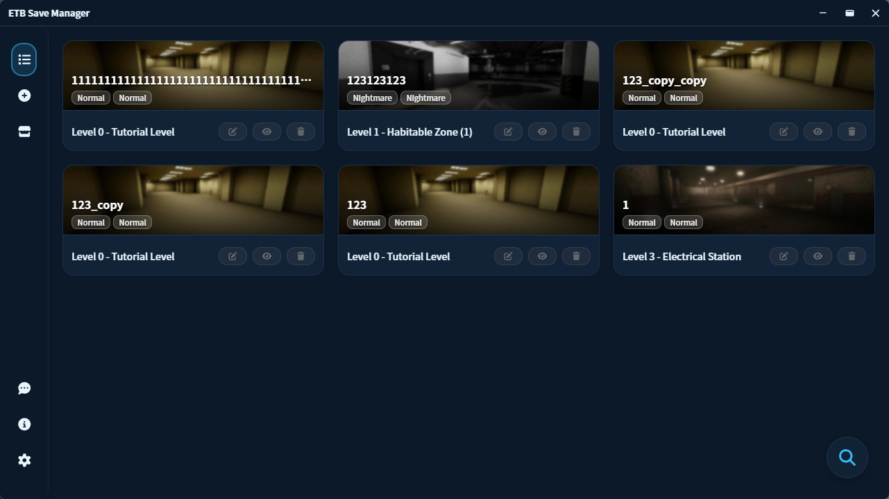
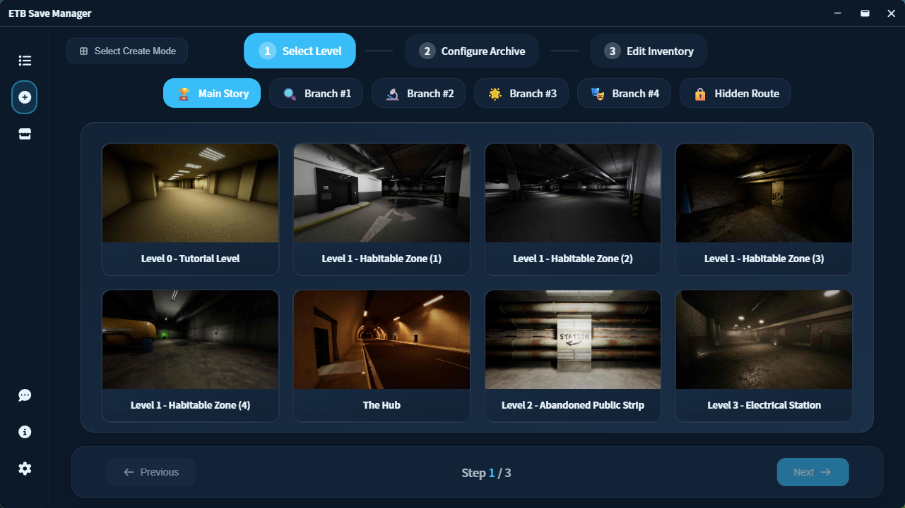
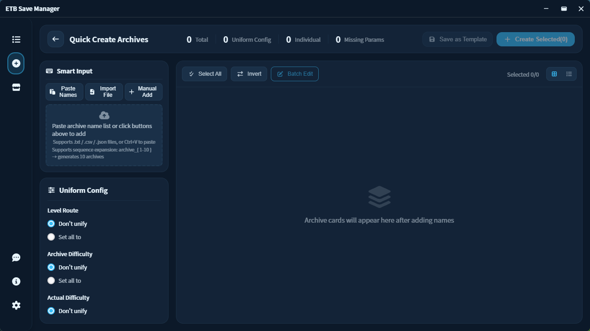
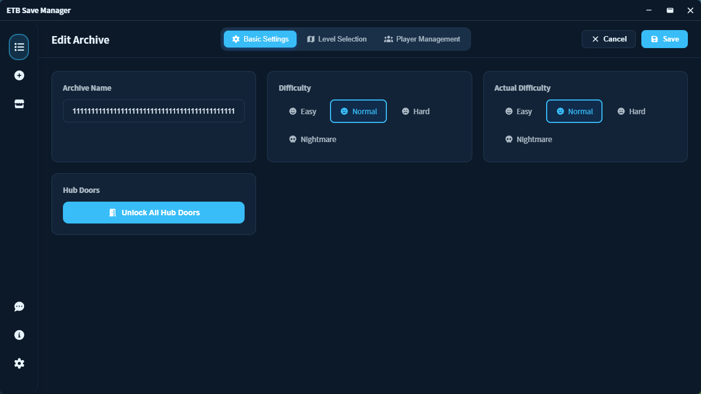

# 🕳️ E.T.B. Save Manager

<p align="center">
  
</p>

<p align="center">
  <a href="https://github.com/Eververdants/ETBSaveManager/releases"></a>
  <a href="LICENSE"></a>
  
  
</p>

<p align="center">
  <b>A modern, cross-platform save management tool for "Escape The Backrooms"</b>
</p>

<p align="center">
  <a href="./README-CN.md">简体中文</a> | <a href="./README-HANT.md">繁體中文</a> | <a href="#">English</a>
</p>

---

## ✨ Features

### 🗂️ Save Management

- **Full CRUD Operations** — Create, edit, delete, copy, hide/show saves
- **Batch Operations** — Process multiple saves simultaneously
- **Smart Filtering** — Filter by level, difficulty, game mode
- **Quick Search** — Fuzzy matching to locate saves instantly
- **Virtual Scrolling** — Smooth performance with large save collections

### 🎨 Modern UI/UX

- **Modern Design** — Clean, intuitive interface with smooth animations
- **15+ Themes** — Light, Dark, colorful themes, and seasonal specials
- **Responsive Layout** — Collapsible sidebar, adaptive components
- **Hardware Accelerated** — GPU-optimized rendering for smooth performance
- **GSAP Animations** — Professional-grade animations throughout

### 🌍 Internationalization

Built-in languages:

- Simplified Chinese (简体中文)
- Traditional Chinese (繁體中文)
- English

Additional languages via plugins:

- 日本語 (Japanese)
- 한국어 (Korean)
- Русский (Russian)
- Português (Brazilian Portuguese)

> ⚠️ **Note:** Language plugins may not be updated immediately with new app versions.

### 🛠️ Advanced Features

- **Multiple Creation Modes**
  - Quick Create — Streamlined workflow for fast save generation
  - Standard Create — Full customization options with step-by-step wizard
- **Inventory Editor** — Visual editor for player inventory items
- **Player Data Editor** — Edit health, position, and other player stats
- **Steam Cache Management** — Manage local Steam cache data
- **Feedback System** — Built-in feedback submission with offline queue
- **Plugin Market** — Download language packs and themes from the plugin marketplace
- **Performance Monitor** — Built-in diagnostics (dev mode)
- **Auto-Update** — Automatic update checks and installation

---

## 🖥️ Screenshots

> Screenshots below are demonstrated using the "Ocean" theme

<p align="center">
  
  
</p>

<p align="center">
  
  
</p>

---

## 📦 Installation

### Download Release

1. Go to [Releases](https://github.com/Eververdants/ETBSaveManager/releases/latest)
2. Download the Windows installer (`.msi` or `.exe`)
3. Run the installer

> **Note:** You may need [WebView2 Runtime](https://developer.microsoft.com/microsoft-edge/webview2) (usually pre-installed on Windows 10/11)

### Build from Source

```bash
# Clone repository
git clone https://github.com/Eververdants/ETBSaveManager.git
cd ETBSaveManager

# Install dependencies
pnpm install

# Development mode
pnpm tauri dev

# Build for production
pnpm tauri build
```

**Prerequisites:**

- Node.js 18+
- Rust toolchain
- Platform-specific dependencies (see [Tauri Prerequisites](https://tauri.app/v1/guides/getting-started/prerequisites))

---

## 🧰 Tech Stack

### Frontend

| Technology | Purpose |
|------------|---------|
| Vue 3 + Composition API | Reactive UI framework |
| Vite 6 | Build tool and dev server |
| Tailwind CSS 4 | Utility-first CSS framework |
| CSS Variables | Dynamic theme system |
| vue-i18n | Internationalization |
| Vue Router 4 | SPA routing |
| GSAP | High-performance animations |
| @tanstack/vue-virtual | Virtual scrolling for large lists |
| FontAwesome 7 | Vector icons |
| Chart.js | Data visualization |
| @vue-flow/core | Node-based flow editor |

### Backend (Rust)

| Technology | Purpose |
|------------|---------|
| Tauri 2.0 | Desktop application framework |
| uesave 0.6.2 | UE4 Save file parsing |
| serde + serde_json | Data serialization |
| aes-gcm + argon2 | Encryption and security |
| rusqlite | Local SQLite database |
| reqwest + tokio | Async HTTP client |
| walkdir + memmap2 | Efficient file operations |

---

## 📁 Project Structure

```
ETBSaveManager/
├── src/                          # Vue Frontend
│   ├── components/               # UI Components
│   │   ├── plugin/              # Plugin-related components
│   │   ├── ArchiveCard.vue      # Save card component
│   │   ├── ArchiveSearchFilter.vue # Search and filter panel
│   │   ├── Sidebar.vue          # Navigation sidebar
│   │   ├── TitleBar.vue         # Window title bar
│   │   └── ...                  # Other components
│   ├── composables/             # Vue Composition Functions
│   │   ├── useArchiveActions.js # Save operations logic
│   │   ├── useArchiveData.js    # Save data management
│   │   └── ...                  # Other composables
│   ├── config/                  # Configuration files
│   ├── i18n/                    # Internationalization
│   │   └── locales/             # Language files
│   │       ├── zh-CN/           # Simplified Chinese
│   │       ├── zh-TW/           # Traditional Chinese
│   │       └── en-US/           # English
│   ├── plugins/                 # Plugin System
│   │   ├── core/                # Plugin manager
│   │   └── loaders/             # Plugin loaders (language, theme, page)
│   ├── router/                  # Vue Router configuration
│   ├── services/                # Business logic services
│   ├── styles/                  # Styling system
│   │   └── themes/              # Theme files (15+ themes)
│   ├── utils/                   # Utility functions
│   ├── views/                   # Page views
│   │   ├── CreateArchive/       # Create save wizard
│   │   ├── Home.vue             # Save list page
│   │   ├── EditArchive.vue      # Edit save page
│   │   └── ...                  # Other pages
│   ├── App.vue                  # Root component
│   └── main.js                  # Application entry
├── src-tauri/                    # Rust Backend
│   └── src/
│       ├── lib.rs               # Library entry
│       ├── main.rs              # Main entry
│       ├── save_commands.rs     # Save operation commands
│       ├── save_editor.rs       # Save file editor
│       ├── player_data.rs       # Player data handling
│       ├── steam_api.rs         # Steam API integration
│       ├── feedback_commands.rs # Feedback system
│       └── ...                  # Other modules
├── plugins/                      # Plugin Directory
│   ├── lang-ja-JP/              # Japanese language pack
│   ├── lang-ko-KR/              # Korean language pack
│   ├── lang-ru-RU/              # Russian language pack
│   ├── lang-pt-BR/              # Brazilian Portuguese pack
│   ├── theme-cyberpunk/         # Cyberpunk theme
│   ├── theme-dracula/           # Dracula theme
│   ├── theme-monokai/           # Monokai theme
│   ├── theme-nord/              # Nord theme
│   └── theme-solarized/         # Solarized theme
├── public/                       # Static Assets
│   ├── icons/                   # Game item icons (20+)
│   └── images/                  # Game level images (40+)
└── docs/                         # Documentation and screenshots
```

---

## 🎨 Themes

ETB Save Manager includes 15+ built-in themes:

### Basic Themes
- **Light** — Clean light theme
- **Dark** — Comfortable dark theme
- **High Contrast** — Accessibility-focused theme

### Color Themes
- **Ocean** 🌊 — Deep blue ocean-inspired
- **Forest** 🌲 — Natural green forest theme
- **Sunset** 🌅 — Warm orange sunset colors
- **Lavender** 💜 — Soft purple lavender
- **Rose** 🌸 — Elegant pink rose
- **Mint** 🍃 — Fresh mint green
- **Peach** 🍑 — Soft peach tones
- **Sky** ☁️ — Bright sky blue

### Seasonal Themes
- **New Year** 🎊 — New Year celebration theme
- **Spring Festival** 🧧 — Chinese New Year theme (limited time)

### Plugin Themes
- **Cyberpunk** — Neon cyberpunk aesthetic
- **Dracula** — Popular Dracula color scheme
- **Monokai** — Classic Monokai theme
- **Nord** — Arctic Nord color palette
- **Solarized** — Solarized color scheme

---

## 🚧 Development Status

**Current Version:** `v3.1.0`

| Feature | Status |
|---------|--------|
| Core Save Management | ✅ Complete |
| Search & Filter | ✅ Complete |
| Theme System (15+ themes) | ✅ Complete |
| Multi-language Support | ✅ Complete |
| Save Data Editor | ✅ Complete |
| Creation Modes (Quick & Standard) | ✅ Complete |
| Feedback System | ✅ Complete |
| Plugin System | ✅ Complete |
| Theme Editor | ✅ Complete |
| Inventory Editor | ✅ Complete |
| Player Data Editor | ✅ Complete |
| Steam Cache Management | ✅ Complete |
| Auto-Update | ✅ Complete |
| Level Info Editor | 🔄 Planned |

---

## 🎬 Video Tutorial

Watch the detailed operation guide: [Bilibili Video](https://www.bilibili.com/video/BV1L3yeYzEfi) (Based on v2.6.0)

---

## 🤝 Contributing

Contributions are welcome! This is a personal student project, and any help is appreciated.

- 🐛 [Report bugs](https://github.com/Eververdants/ETBSaveManager/issues)
- 💡 [Request features](https://github.com/Eververdants/ETBSaveManager/issues)
- 📧 Contact: **llzgd@outlook.com**

### Plugin Development

Want to create your own language pack or theme? Check out the [Plugin Development Guide](./plugins/PLUGIN_DEV_GUIDE_EN.md).

---

## ⚠️ Disclaimer

This project is **not affiliated with, endorsed by, or connected to** Fancy Games or *Escape The Backrooms* in any way.

Game assets (e.g., level icons) are used **strictly for identification purposes** to help users recognize which level a save file belongs to.  
All rights to *Escape The Backrooms* and its assets belong to their respective owners.

---

## 📄 License

[MIT License](LICENSE) © 2024-NOW Eververdants

---

<p align="center">
  <sub>Built with ❤️ using Vue.js and Tauri</sub>
</p>
